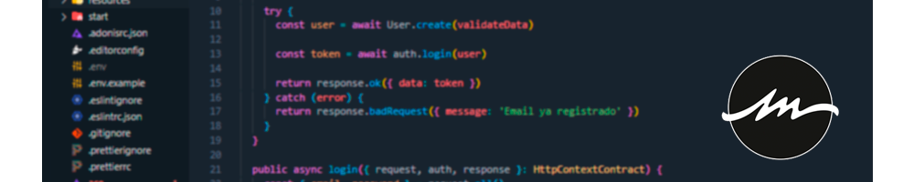

# Welcome to my **Backend Developer** Github repository!

## 🧑🏻‍💻 Let me tell you about me
> 
> I am currently employed as a backend developer in [OpenBootcamp](https://open-bootcamp.com/) in which I am also training as a Full Stack developer in technologies such as Java, Spring, NodeJS, and NodeJS based frameworks. Developing projects totally oriented to the labor sector.
> 
> On the other hand, I continue to develop personally with writers, content creators and philosophies that help me in my day to day and connect my professional, sentimental and personal environment.

## 💻 Technologies
|Frontend|Backend|Databases|CI/CD|
|:-:|:-:|:-:|:-:|
|     |     |   | |

## Social links

 
 

